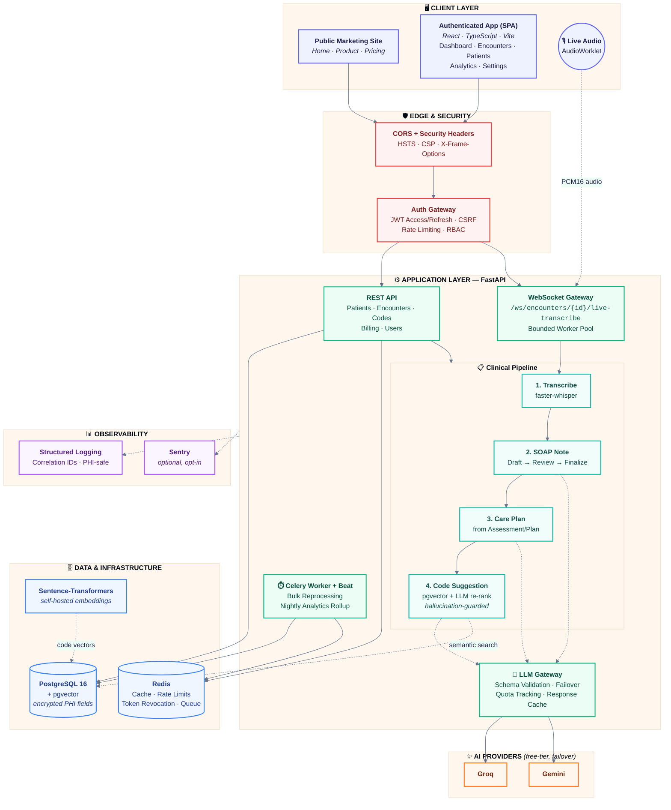

# MedScribe AI

**AI-powered clinical documentation automation for modern medical practices.**

[](.github/workflows/ci.yml)
[](backend)
[](frontend)
[](docs/deployment.md)

---

## Overview

MedScribe AI is a full-stack, production-grade reference platform for automating clinical documentation. It takes a raw doctor-patient encounter — spoken live, uploaded as audio, or pasted as text — and turns it into a structured, clinician-reviewed SOAP note, a care plan, and billing-ready ICD-10/HCPCS code suggestions, all within an auditable, role-gated workflow. A practice-facing analytics dashboard then turns the resulting encounter data into visibility on volume, turnaround time, coding mix, and estimated reimbursement.

The system is built end to end: authentication and authorization, encrypted data storage, a resilient multi-provider LLM gateway, real-time transcription over WebSockets, background job processing, and a hardened, documented API — with no shortcuts taken on the parts that make healthcare software trustworthy. See [`plan (1).md`](plan%20%281%29.md) for the full phase-by-phase development plan this repository implements.

## Objectives

- **Eliminate manual note-writing overhead.** Replace free-text, after-the-fact charting with structured, LLM-assisted SOAP notes generated directly from the encounter itself.
- **Reduce coding errors and revenue leakage.** Ground every ICD-10/HCPCS suggestion in a real, versioned code database via semantic (pgvector) retrieval, and never accept a code the model invented outside that retrieved set.
- **Keep a clinician in the loop at every step.** No AI output reaches a patient record or a claim without an explicit human review-and-finalize gate.
- **Treat security and compliance as first-class requirements, not an afterthought.** Field-level encryption, organization-level data isolation, CSRF-protected auth, structured PHI-safe logging, and a documented compliance posture are part of the base design, not a later patch.
- **Give practice administrators operational visibility.** Turn encounter-level data into aggregate insight on productivity, coding mix, turnaround time, and reimbursement — without manual spreadsheet work.
- **Stay operationally realistic on free-tier infrastructure.** Every dependency (LLM providers, embeddings, transcription, hosting) is chosen to work on free tiers or self-hosted, so the system is genuinely runnable, not just architecturally sound on paper.

## What We Build

| Capability | Description |
|---|---|
| **Encounter ingestion** | Three paths into the pipeline: pasted transcript text, uploaded audio (self-hosted Whisper), or live in-browser recording streamed over a WebSocket. |
| **SOAP note generation** | LLM-drafted Subjective/Objective/Assessment/Plan notes from the raw transcript, with clinician edit, review, and finalize states before anything downstream can act on them. |
| **Care plan generation** | Generated strictly from a finalized note's Assessment/Plan section — never from the raw transcript — to keep the care plan traceable to a clinical decision. |
| **Medical coding assistant** | ICD-10 and HCPCS code suggestions from pgvector semantic search over a real reference database, re-ranked by the LLM, with a hallucination guard that discards any code not present in the retrieved candidate set, and an explicit coder accept/reject workflow. |
| **Revenue & analytics dashboard** | Pre-aggregated rollups — encounter volume, coding mix, estimated reimbursement, turnaround time, LLM cost/usage, and clinician productivity — with CSV/Excel export. |
| **Role-based application** | A distinct experience for clinicians, coders, and admins, backed by server-enforced RBAC and organization-level data isolation, not just UI-level hiding. |
| **Public marketing site** | A standalone marketing surface (home, product, solutions, pricing, about, contact) sharing one design system with the authenticated app, code-split so anonymous visitors never download authenticated-app-only code. |

## How It Helps

- **Clinicians** spend less time typing and more time on care — a note drafts itself from the conversation that already happened, and only needs review, not authorship from scratch.
- **Medical coders** work from database-grounded code suggestions instead of memory or manual lookup, with the LLM narrowing a large code set to a relevant, explainable shortlist rather than free-generating codes.
- **Practice administrators** get a real-time view of throughput, revenue exposure, and staff productivity without building it themselves in a spreadsheet.
- **Compliance and security stakeholders** get a system designed around data minimization, encryption, auditability, and documented gaps — not a black box that has to be reverse-engineered for a HIPAA review.
- **Engineering teams adopting this as a reference** get a complete, tested implementation of the hard parts of a clinical AI product — multi-provider LLM failover, hallucination guarding, real-time audio streaming, and PHI-safe logging — that would otherwise be rebuilt from scratch on every project.

## Architecture

MedScribe AI is a three-tier system: a React SPA, a FastAPI application server, and a set of managed data/infra services, with an internal LLM gateway abstracting over external AI providers so the core pipeline never depends on a single vendor.



**Design principles reflected above:**

- **Single point of LLM contact.** Every AI call passes through one gateway (`app/llm/gateway.py::generate()`), so provider failover, quota tracking, schema validation, and caching are enforced exactly once, not per feature.
- **Human gates on every irreversible step.** A SOAP note must be finalized before care-plan or coding can run against it; code suggestions must be explicitly accepted or rejected by a coder.
- **Defense at the edge, not just the endpoint.** CORS, security headers, and the auth/CSRF gateway sit in front of every request, independent of what an individual route does or forgets to do.
- **No hard dependency on a single AI vendor or paid tier.** Groq and Gemini free tiers with automatic failover, and self-hosted embeddings/transcription, keep the system runnable without a paid AI subscription.

### Technology stack

| Layer | Technology |
|---|---|
| Backend | Python, FastAPI, SQLAlchemy 2.0 (async), Alembic |
| Database | PostgreSQL 16 + pgvector |
| Embeddings | Self-hosted `sentence-transformers` (`all-MiniLM-L6-v2`) |
| Transcription | Self-hosted `faster-whisper` |
| Queue / Cache | Redis, Celery (worker + beat) |
| Auth | JWT access/refresh, RBAC, CSRF double-submit, Fernet field-level encryption |
| LLM providers | Groq, Gemini (free tiers, automatic failover) |
| Frontend | React, TypeScript, Vite, Tailwind, TanStack Query, Recharts |
| Observability | structlog (structured, PHI-safe), optional Sentry |
| Containerization | Docker Compose |
| CI | GitHub Actions (`.github/workflows/ci.yml`) |

## Prerequisites

- Docker and Docker Compose
- Python 3.11+ and `uv` (or `pip`) for running backend scripts outside a container
- Node.js 20+ and npm for the frontend

## Local setup

1. Copy the environment template and adjust host ports if 5432/6379 are already in use on your machine:

   ```
   cp .env.example .env
   ```

2. Start Postgres (with pgvector) and Redis:

   ```
   docker compose up -d postgres redis
   ```

3. Install backend dependencies:

   ```
   cd backend
   uv venv .venv
   uv pip install -e . --python .venv
   cp ../.env.example .env
   ```

4. Run database migrations:

   ```
   .venv/Scripts/python -m alembic upgrade head        # Windows
   .venv/bin/python -m alembic upgrade head             # macOS/Linux
   ```

5. Load ICD-10 and HCPCS reference codes (generates embeddings, see `docs/datasets.md`):

   ```
   python -m scripts.load_reference_codes
   ```

6. Seed demo organization, users, patients, and encounters:

   ```
   python -m scripts.seed_encounters
   ```

7. Create the first admin user for an organization (registration is admin-invited only; there is no public self-signup):

   ```
   python -m scripts.create_admin --org "Your Clinic" --email admin@example.com --password "ChangeMe123!" --name "Admin User"
   ```

8. Start the API:

   ```
   .venv/Scripts/python -m uvicorn app.main:app --reload   # or: docker compose up -d backend worker
   ```

   Then log in at `POST /auth/login` (OAuth2 password flow: `username` is the email) and use the returned bearer token for subsequent requests. See `docs/security.md` for the full auth flow, RBAC, and CSRF details.

9. Set `GROQ_API_KEY` and/or `GEMINI_API_KEY` in `.env` to exercise the clinical pipeline against real providers (both are free-tier). Create a patient, then an encounter:

   ```
   POST /patients                              {"first_name": "...", "last_name": "..."}
   POST /encounters                             {"patient_id": "...", "raw_transcript": "Doctor: ... Patient: ..."}
   POST /encounters/audio                       multipart: patient_id + audio file (transcribed via faster-whisper)
   POST /encounters/{id}/soap-note               generate
   PATCH /encounters/{id}/soap-note              edit
   POST /encounters/{id}/soap-note/review        transcribed note -> under review
   POST /encounters/{id}/soap-note/finalize      under review -> finalized (required before coding)
   POST /encounters/{id}/care-plan               generate (from the SOAP note's Assessment/Plan only)
   POST /encounters/{id}/codes                   generate ICD-10/HCPCS suggestions (pgvector + LLM, finalized notes only)
   PATCH /encounters/{id}/codes/{suggestion_id}   accept/reject (coder/admin only)
   GET  /encounters/{id}                          full detail: transcript, note, care plan, code suggestions
   ```

   Without real API keys, run the test suite instead (it mocks the provider adapters).

10. For live in-browser transcription, first create the encounter, then open a WebSocket:

    ```
    POST /encounters/live                                        {"patient_id": "..."}   -> status "recording"
    WS   /ws/encounters/{id}/live-transcribe?token=<access_token>
    ```

    See `docs/live-transcription.md` for the full message protocol (binary PCM16 audio in; `queued`/`ready`/`partial`/`final`/`stopped`/`error` JSON messages out).

11. For batch work (bulk SOAP note reprocessing), start a Celery worker and use the async endpoint:

    ```
    docker compose up -d worker    # or: celery -A app.worker worker --loglevel=info

    POST /encounters/bulk-reprocess   {"encounter_ids": ["...", "..."]}   -> 202 + task_id
    GET  /tasks/{task_id}
    ```

    See `docs/hardening.md`.

12. For revenue and analytics, set a reimbursement rate, then trigger and read a rollup:

    ```
    PUT  /reimbursement-rates                    {"code_type": "icd10", "code": "E11.9", "rate": 150.0}
    POST /analytics/rollup                        {}   -> computes all 6 metrics for your org, defaults to yesterday
    GET  /analytics/encounter_volume?start_date=2026-01-01&end_date=2026-01-31
    GET  /analytics/estimated_reimbursement/export?start_date=2026-01-01&end_date=2026-01-31&format=xlsx
    ```

    Nightly rollups run automatically at 02:00 UTC once a Celery beat process is running (`celery -A app.worker beat`), alongside the worker started in the previous step. See `docs/analytics.md`.

13. Start the frontend, pointed at the backend from step 8:

    ```
    cd frontend
    npm install
    cp .env.example .env   # set VITE_BACKEND_URL to your backend's address
    npm run dev
    ```

    Open the URL Vite prints (it picks the first free port from 5173 up). The public marketing site is served at `/`; log in at `/login` with the admin created in step 7 to reach the authenticated app at `/app`. See `docs/frontend.md` for the architecture, the auth/cookie model, and why the dev server proxies the API instead of calling it cross-origin.

## Running tests

```
cd backend
.venv/Scripts/python -m pytest -m "not slow"
```

The `slow` marker covers tests that load the Whisper model (audio transcription). Run them as a separate invocation:

```
.venv/Scripts/python -m pytest -m slow
```

On memory-constrained hosts, run them separately rather than in one combined `pytest` invocation: loading sentence-transformers/torch (embeddings) and faster-whisper/ctranslate2 (transcription) in the same process at the same time can exceed available memory on a small dev machine (`mkl_malloc: failed to allocate memory`). This is a resource ceiling of a constrained host, not a code issue — both suites pass reliably run separately, and in a real deployment Whisper runs in its own worker process anyway (see Phase 5 of `plan (1).md`).

## Deployment

Not yet deployed to a public URL (needs real hosting accounts). `docs/deployment.md` covers exactly what to provision and in what order, including two decisions that determine whether it actually works (pgvector-capable Postgres hosting, and the frontend/backend cookie-origin setup). `.github/workflows/ci.yml` runs lint/type-check/test/build/dependency-audit on every push and PR.

## Further documentation

- `docs/database-schema.md`: full schema reference
- `docs/datasets.md`: dataset sources and loading instructions
- `docs/security.md`: authentication, authorization, encryption, and audit logging
- `docs/llm-strategy.md`: Groq/Gemini failover strategy, prompt design, and token minimization
- `docs/api-reference.md`: endpoint summary; the live OpenAPI docs at `/docs` are authoritative
- `docs/live-transcription.md`: the WebSocket protocol, audio format, worker pool, checkpointing, and fallback behavior
- `docs/hardening.md`: pagination, validation, error handling/correlation IDs, structured logging, background tasks, load/failover testing, and coverage
- `docs/analytics.md`: the six analytics metrics, pre-aggregation design, reimbursement rate table, and CSV/Excel export
- `docs/frontend.md`: frontend architecture, the auth/cookie model, the live-transcription hook, and what has/hasn't been verified
- `docs/data-flow-review.md`: the Phase 9 PHI-logging/TLS/JWT-lifetime review, including one real fix it found
- `docs/security-audit.md`: dependency vulnerability findings, what was upgraded, and what's an accepted/documented risk
- `docs/compliance.md`: HIPAA-style safeguards checklist, minimum-necessary data collection, retention/deletion policy, and the compliance disclaimer
- `docs/deployment.md`: what to provision, the two decisions that actually matter, and the final walkthrough checklist
